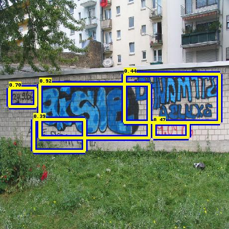

# Graffiti Detection with Keras
This framework can be used to design and train object detectors with the
Keras API for tensorflow. The current implementation was developed with a
strong focus on the detection of graffiti objects, but the architecture can be
used to train class agnostic detectors in general.
Different pre-trained models on the graffiti detection tasks are available.
Contributions and extensions to the codebase as well as model submissions are
welcome.

The training process relies on bounding box annotations that have to be
generated with the [labelImg](https://github.com/tzutalin/labelImg) tool by [tzutalin](https://github.com/tzutalin) in advance.

  

## Use Cases

The following *use cases* are covered by this framework:
* Detection of graffiti objects in images with pre-trained models (Keras and Tensorflow Object Detection API)
* Evaluation of different models for a set of annotated test data
* Configuring and training a Keras model for agnostic image classification
* Configuring and training a Keras model for agnostic object detection
* Reversing xml annotations from detection results that are compatible with [labellimg](https://github.com/tzutalin/labelImg)
* Automatically split a set of annotations into test/train sets (training process organization)
* Generate TFRecords from xml annotations that are ready to be used with [tensorflow object detection api](https://github.com/tensorflow/models/tree/master/research/object_detection)

## Setup
  * <a href='doc/installation.md'>
      Installation</a> 
  * <a href='doc/file_structure.md'>
      File organsation/ Directory structure</a> 

## Quick Start:
  * <a href='graffiti_detection_with_keras_example.ipynb'>
      Quick Start: Jupyter Notebook for Graffiti Detection with Keras Models</a> 
  * <a href='graffiti_detection_with_tensorflow_example.ipynb'>
      Quick Start: Jupyter Notebook for Graffiti Detection with Tensorflow Models</a> 

## Create a Custom Object Detector with Keras:

This series demonstrate how to configure an object detection pipeline with Keras
and start the training process and obtain a model that is ready for object detection.

* <a href='doc/preparing_inputs.md'>
    Preparing Input Data</a> 
* <a href='doc/configuration.md'>
    Configuring a Pipeline</a> 
* <a href='doc/training_example.md'>
    Running a Training Process</a> 

## Using Keras Models for Object Detection and Evaluation:

* <a href='doc/evaluation_and_detection.md'>
    Evaluation and Detection with Keras Models</a> 
